# 📚 Bookia — Flutter Bookstore App


A modern **Flutter bookstore application** built as part of the Flutter course sessions.

This version reflects the project progress up to **Session 22**, where the app was extended beyond the previous authentication, home, wishlist, cart, and profile UI work to include more complete backend-connected flows such as:

- full product search
- checkout to place order flow
- governorates loading
- profile update with image upload
- password update
- order history retrieval

The project demonstrates how to build a clean and scalable Flutter app using:

- **Cubit** for state management
- **Dio** for API integration
- **GoRouter** for navigation
- **SharedPreferences** for local caching
- reusable widgets and organized feature folders
- shimmer loading states and dialog-based loading feedback

---

# ✨ What Was Added / Improved in Session 22

## Main updates in this version

- Added a full **Search module**
  - opens with all products loaded by default
  - supports live searching through API
  - uses debounced search input
  - shows loading using dialog-based feedback

- Completed the **checkout → place order** flow
  - checkout data is fetched from backend
  - place order screen receives total and user data
  - governorates are loaded from API
  - successful order navigates to the success screen

- Connected **My Orders** screen to backend
  - fetches real order history
  - handles loading, success, empty state, and error state

- Connected **Edit Profile** screen to backend
  - updates name, phone, address
  - supports updating profile image
  - refreshes cached user data after update

- Connected **Reset Password** screen to backend
  - validates current password, new password, and confirmation
  - updates password through API

- Improved routing and feature coverage
  - added dedicated route for search
  - organized profile-related flows
  - extended app navigation around e-commerce actions

---

# 🚀 Core Features

## 1) Authentication & Onboarding

- Splash screen
- Welcome screen
- Login
- Register
- Forget password
- OTP-based reset password flow
- Create new password
- Password changed confirmation

## 2) Home & Product Discovery

- Dynamic home slider
- Best seller products section
- Book details screen
- Search screen
- Product browsing from API
- Search results grid using reusable book cards

## 3) Wishlist & Cart

- Add to wishlist
- Remove from wishlist
- Add to cart
- Remove from cart
- Quantity update in cart
- Total price calculation
- Cart IDs and wishlist IDs cached locally

## 4) Checkout & Orders

- Checkout request before placing order
- Place order form with validation
- Governorate selection from bottom sheet
- Success screen after order placement
- My orders history screen

## 5) Profile Management

- Profile overview screen using cached user info
- Edit profile form
- Profile image update from camera or gallery
- Reset password screen
- Static tiles ready for future FAQ / Contact / Privacy flows

---

# 📱 App Screens Preview

| Splash Screen | Welcome Screen | Login Screen |
|---|---|---|
| 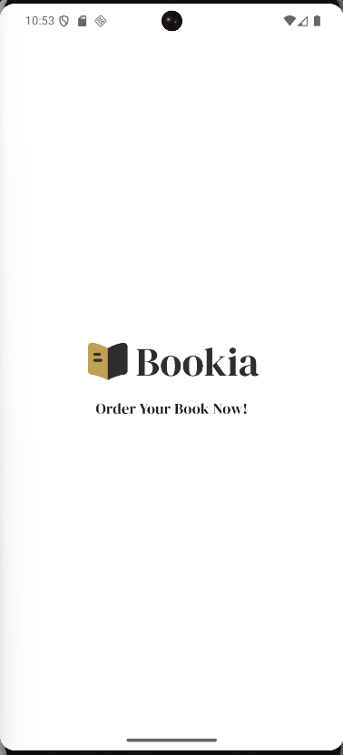 |  | 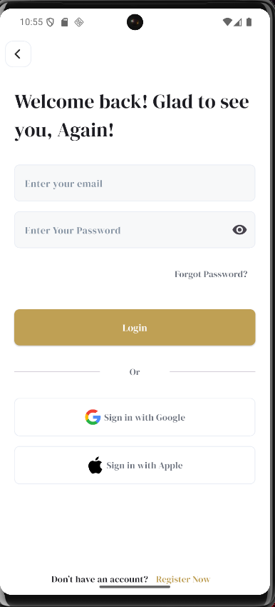 |

| Register Screen | Forget Password Screen | OTP Verification Screen |
|---|---|---|
| 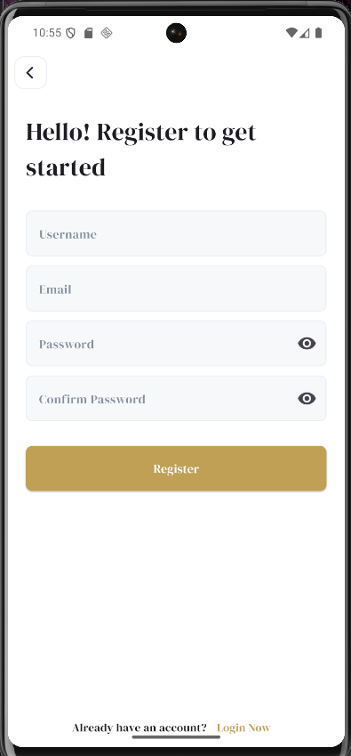 | 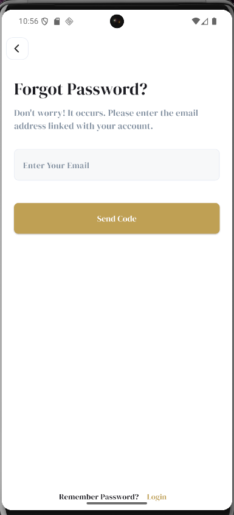 | 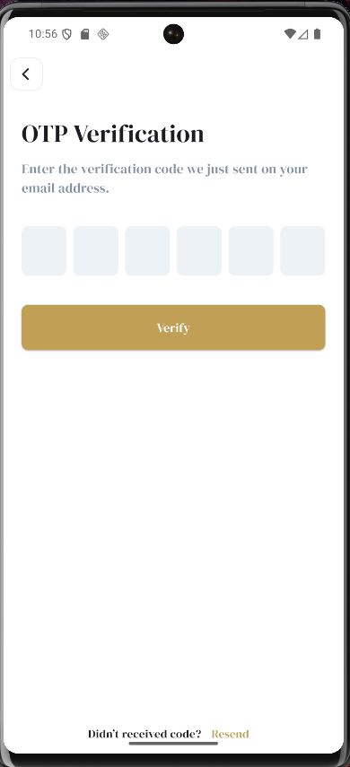 |

| Create New Password Screen | Password Changed Screen | Home Screen |
|---|---|---|
| 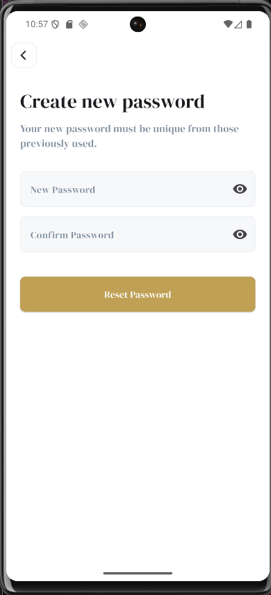 | 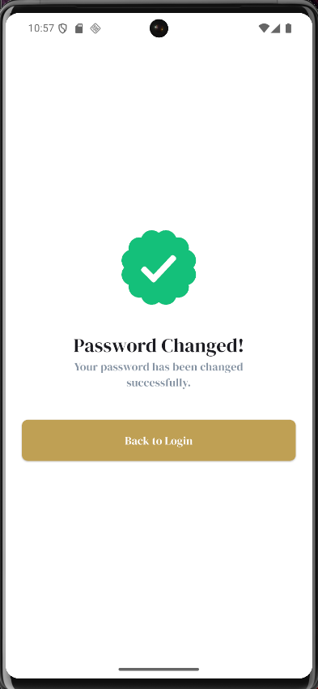 | 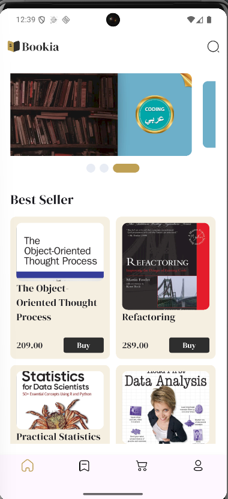 |

| Book Details Screen | Wishlist Screen | Cart Screen |
|---|---|---|
| 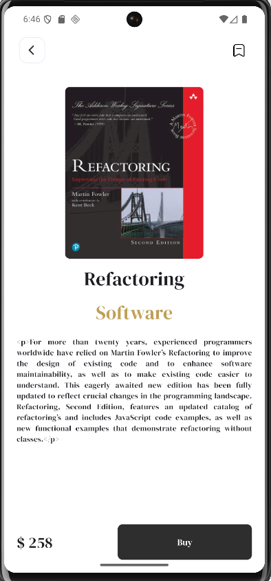 | 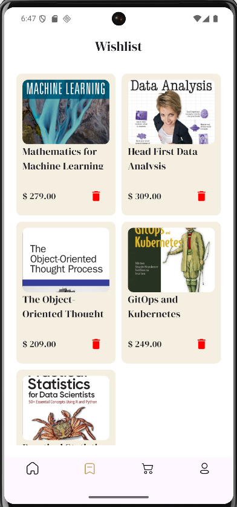 | 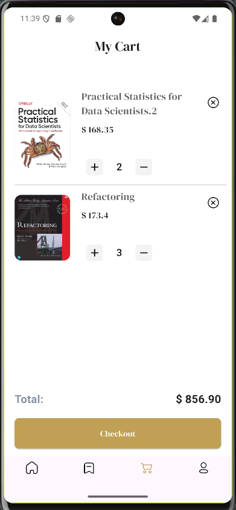 |

| Place Order Screen | Order Success Screen | Profile Screen |
|---|---|---|
| 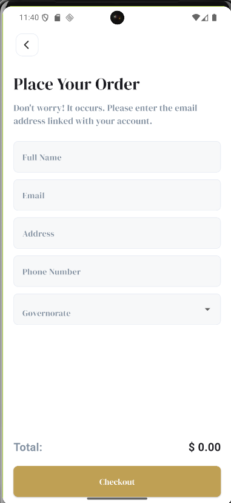 | 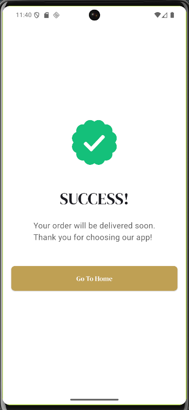 | 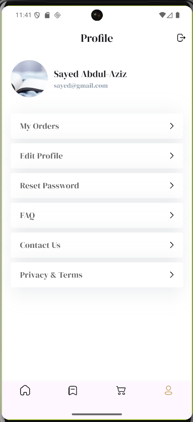 |

| Edit Profile Screen | Reset Password Screen | My Orders Screen |
|---|---|---|
| 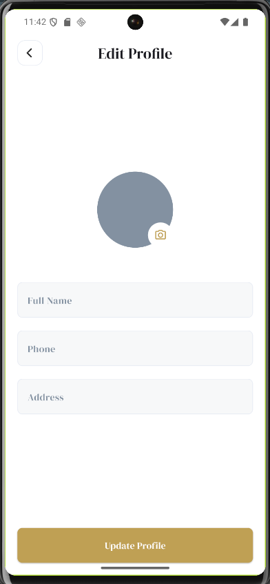 | 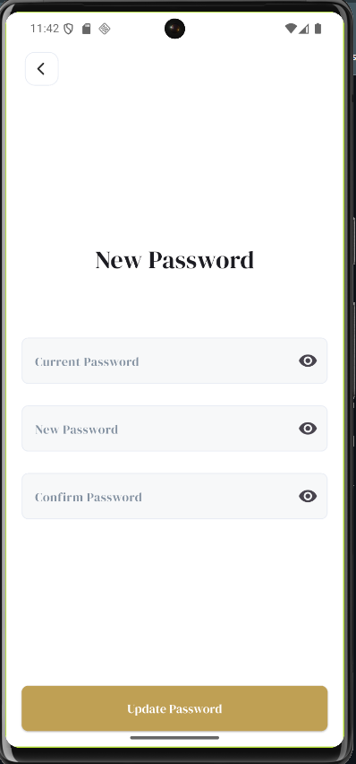 | 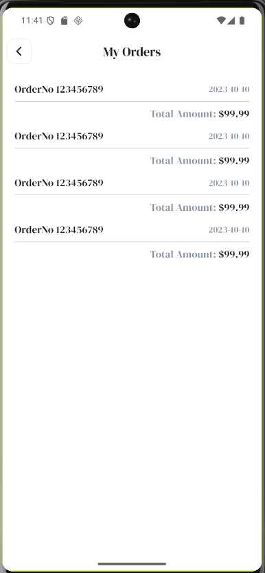 |

| Search Screen |   
|---
| 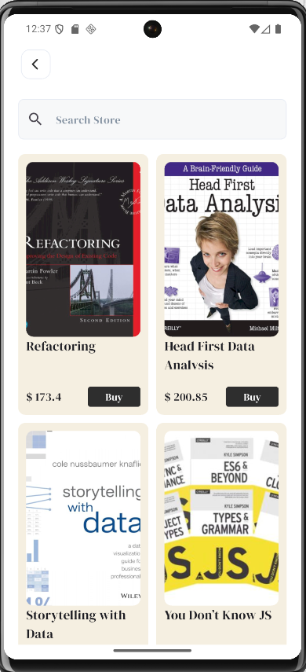 |   

---

# 🏗 Project Architecture

The project follows a **feature-based architecture** to keep the code clean, modular, and easy to scale.
```text
    lib/
    ├── app_root/
    │   └── app_root.dart
    │
    ├── core/
    │   ├── constants/
    │   ├── functions/
    │   ├── routes/
    │   ├── services/
    │   │   ├── api/
    │   │   └── local/
    │   ├── styles/
    │   └── widgets/
    │       └── shimmer/
    │
    ├── features/
    │   ├── auth/
    │   ├── book_details/
    │   ├── cart/
    │   ├── home/
    │   ├── main/
    │   ├── my_orders/
    │   ├── place_order/
    │   ├── profile_folder/
    │   │   ├── profile/
    │   │   ├── edit_profile/
    │   │   └── reset_password/
    │   ├── search/
    │   ├── welcome/
    │   └── wish_list/
    │
    └── main.dart

```
## Why this structure?

- better separation between business logic and UI
- easier maintenance as the app grows
- clearer responsibility for each feature
- easier reuse of widgets, cubits, and repositories
- smoother extension for future sessions and new modules

---

# 🧠 State Management

The app uses **Flutter Bloc / Cubit**.

## Cubits currently used

### AuthCubit
Handles:
- login
- register
- forget password
- reset password flow
- form-related state transitions

### HomeCubit
Handles:
- home slider data
- best seller products
- loading and success states for home content

### WishListCubit
Handles:
- fetching wishlist items
- removing wishlist items
- syncing cached wishlist IDs

### BookDetailsCubit
Handles:
- add to wishlist
- add to cart
- checking local cached IDs for UI state

### CartCubit
Handles:
- fetching cart items
- removing items
- updating quantity
- total price calculation
- checkout request
- syncing cached cart IDs

### PlaceOrderCubit
Handles:
- fetching governorates
- selecting governorate
- submitting place order request

### EditProfileCubit
Handles:
- loading initial user data
- updating profile info
- updating profile image

### ResetPasswordCubit
Handles:
- password update request
- form validation flow
- success / error state management

### MyOrderCubit
Handles:
- fetching order history
- loading, success, and error states

### SearchCubit
Handles:
- fetching all products on screen open
- searching products by name
- loading, success, and error states

---

# 🔌 API Integration

The app communicates with backend services using **Dio**.

## Base URL

`https://codingarabic.online/api/`

## Authentication Endpoints

- `register`
- `login`
- `forget-password`
- `reset-password`

## Home & Catalog Endpoints

- `sliders`
- `products-bestseller`
- `products`
- `products-search`

## Wishlist Endpoints

- `wishlist`
- `add-to-wishlist`
- `remove-from-wishlist`

## Cart & Checkout Endpoints

- `cart`
- `add-to-cart`
- `remove-from-cart`
- `update-cart`
- `checkout`

## Order Endpoints

- `governorates`
- `place-order`
- `order-history`

## Profile Endpoints

- `update-profile`
- `update-password`

---

# 💾 Local Storage

The app uses **SharedPreferences** for lightweight local persistence.

## Cached data

- authentication token
- user information
- wishlist product IDs
- cart product IDs

## Why caching is used

- keep user session data available
- update UI instantly for wishlist/cart checks
- reduce unnecessary repeated checks
- make profile and product actions feel smoother

---

# 🧭 Navigation

The project uses **GoRouter** for app navigation.

## Main routes

- Splash
- Welcome
- Login
- Register
- Forget Password
- OTP Screen
- Create New Password
- Password Changed
- Main App
- Home
- Book Details
- Wishlist
- Place Order
- Congrats / Order Success
- Profile
- Edit Profile
- Reset Password
- My Orders
- Search

## Main bottom navigation tabs

- Home
- Wishlist
- Cart
- Profile

---

# ⚡ Loading & UX Patterns

To improve user experience, the app includes multiple loading approaches:

- shimmer placeholders on content-based screens
- dialog-based loading for actions such as search, profile update, password update, and order history fetch
- empty-state handling for wishlist, cart, and orders
- snackbar feedback for some cart and order actions

---

# 🧩 Reusable Widgets & Shared UI

Examples of reusable widgets in the project:

- `MainButton`
- `CustomTextFormField`
- `PasswordTextFormField`
- `SocialAuthButton`
- `PinCodeSection`
- `BookCard`
- `HomeSlider`
- `WishListIcon`
- `CartTile`
- `ProfileTile`
- `OrderItem`
- shimmer widgets
- dialogs and navigation helpers

These shared widgets help keep the app more maintainable and reduce repeated UI code.

---

# 🛠 Tech Stack

- Flutter
- Dart
- Dio
- Flutter Bloc / Cubit
- GoRouter
- SharedPreferences
- Flutter SVG
- Shimmer
- Carousel Slider
- Smooth Page Indicator
- Gap
- Cached Network Image
- Image Picker

---

# 📚 What This Project Covers

This project is a practical implementation of many important Flutter concepts, including:

- building UI from design
- form validation
- API integration
- clean feature separation
- Cubit state management
- local storage
- reusable widgets
- wishlist flow
- cart flow
- checkout flow
- profile management
- search implementation
- routing between multiple modules

---

# ▶️ Getting Started

## Prerequisites

- Flutter SDK installed
- Android Studio or VS Code
- emulator or physical device
- internet connection for backend requests

## Run the project

1. Clone the repository
2. Run `flutter pub get`
3. Run `flutter run`

---

# 📌 Session Summary

## Session 15 → Session 20
Included:
- authentication flow
- home screen
- slider integration
- best seller products
- book details
- wishlist flow
- reusable UI and shimmer loading

## Session 21
Added:
- cart screen
- quantity controls
- dynamic total price
- checkout screen flow
- order success UI
- profile module UI
- edit profile screen UI
- reset password screen UI
- my orders screen UI
- cart IDs local caching

## Session 22
Added / completed:
- search feature with API integration
- full products listing on search open
- search by product name
- place order backend connection
- governorates API integration
- order history backend integration
- edit profile backend integration
- reset password backend integration
- improved routing for the new flows

---

# 👨‍💻 Developed By

**Mina Adly**

Warehouse Manager and Flutter learner focused on building clean, scalable applications using modern Flutter architecture, Cubit state management, API integration, and reusable UI components.
