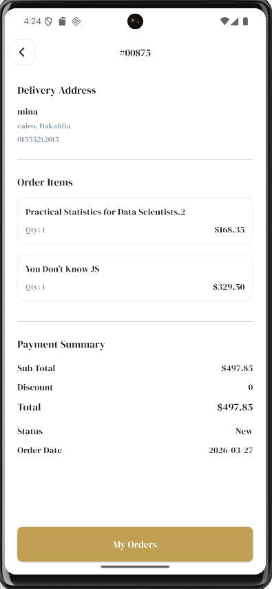

# 📚 Bookia — Modern Flutter Bookstore App (Session 23)


**Bookia** is a modern bookstore application built with **Flutter**, featuring a clean feature-based architecture, backend integration, responsive UI flow, and state management using **Cubit**.

This README reflects the progress up to **Session 23**, where the main task was enhancing the app’s **error handling system** to make API calls safer, cleaner, and easier to maintain across the whole application.

---

## 🎯 Session 23 Main Task — Error Handling

The main achievement in this session was improving the app’s error handling architecture across the networking, repository, and presentation layers.

### ✅ What was improved
- Added a centralized **Failure** model to standardize error handling.
- Introduced clearer failure types such as:
  - `ApiFailure`
  - `NetworkFailure`
  - `CacheFailure`
  - `ParseFailure`
  - `UnknownFailure`
- Updated the networking layer to return `Either<Failure, Data>` instead of raw responses.
- Improved request handling for:
  - `GET`
  - `POST`
  - `PUT`
  - `PATCH`
  - `DELETE`
- Added safer handling for:
  - server-side errors
  - internet connection issues
  - timeout exceptions
  - invalid responses
  - parsing failures
  - unexpected exceptions
- Connected failures properly to UI states through **Cubit**.
- Improved user feedback using:
  - loading dialogs
  - snackbars
  - success/error states
  - better fallback messages

---

## ✨ Key Features & Highlights

### 🌍 Localization & RTL Support
- Arabic and English language support
- Correct **RTL / LTR** layout behavior
- Global language switching using `AppCubit`
- Localized UI text through localization files

### 🔐 Authentication Flow
- Splash screen
- Welcome screen
- Login screen
- Register screen
- Forgot password flow
- OTP verification
- Create new password
- Password changed success screen

### 📚 Product Discovery & Details
- Home screen with slider banners
- Best seller books loaded from API
- Search screen with dynamic results
- Book details screen with image, description, and pricing

### ❤️ Wishlist Management
- Add books to wishlist
- Remove books from wishlist
- Local wishlist sync for fast UI feedback

### 🛒 Cart & Checkout
- Fetch cart items from API
- Update quantity
- Remove cart items
- Calculate total price
- Checkout flow integration

### 📦 Place Order & Orders Tracking
- Governorates fetched from API
- Place order form validation
- Order creation flow
- My Orders screen
- Order details screen with address, items, and summary

### 👤 Profile & Account Settings
- View profile data
- Edit profile
- Reset password
- Logout
- Profile image handling

---

## 📱 Screenshots Preview

### 🔹 Onboarding & Authentication
| Splash | Welcome | Login | Register |
|:---:|:---:|:---:|:---:|
|  |  |  |  |

| Forgot Password | OTP Verification | New Password | Success |
|:---:|:---:|:---:|:---:|
|  |  |  |  |

### 🔹 Home, Search & Details
| Home | Search | Book Details |
|:---:|:---:|:---:|
|  |  |  |

### 🔹 Wishlist, Cart & Checkout
| Wishlist | Cart | Place Order | Order Success |
|:---:|:---:|:---:|:---:|
|  |  |  |  |

### 🔹 Profile & Orders
| Profile | Edit Profile | My Orders | Order Details |
|:---:|:---:|:---:|:---:|
|  |  |  |  |

---

## 🛠 Tech Stack & Packages

- **Flutter SDK**
- **Dart**
- **Flutter Bloc / Cubit**
- **Dio**
- **Dartz**
- **GoRouter**
- **SharedPreferences**
- **Flutter SVG**
- **Shimmer**
- **Carousel Slider**
- **Smooth Page Indicator**
- **Cached Network Image**
- **Image Picker**
- **Pinput**
- **Lottie**
- **Gap**

---

## 🏗 Project Architecture

The app follows a clean **Feature-Based Architecture** to keep the code scalable and maintainable.

```text
lib/
├── app_root/
│   └── app_root.dart
├── core/
│   ├── constants/
│   ├── cubits/
│   │   └── app_cubit/
│   ├── functions/
│   ├── localization/
│   ├── routes/
│   ├── services/
│   │   ├── dio/
│   │   │   ├── api.dart
│   │   │   ├── base_response.dart
│   │   │   ├── dio_provider.dart
│   │   │   └── failure.dart
│   │   └── local/
│   ├── styles/
│   └── widgets/
├── features/
│   ├── auth/
│   ├── book_details/
│   ├── cart/
│   ├── home/
│   │   ├── home/
│   │   └── search/
│   ├── main/
│   ├── orders/
│   │   ├── my_orders/
│   │   └── order_details/
│   ├── place_order/
│   ├── profile_folder/
│   │   ├── edit_profile/
│   │   ├── profile/
│   │   └── reset_password/
│   ├── welcome/
│   └── wish_list/
└── main.dart
```

---

## 🧠 State Management

The project uses **Cubit** to manage states in a feature-based way.

### Main Cubits
- `AppCubit`
- `AuthCubit`
- `HomeCubit`
- `SearchCubit`
- `BookDetailsCubit`
- `CartCubit`
- `WishListCubit`
- `PlaceOrderCubit`
- `MyOrderCubit`
- `OrderDetailsCubit`
- `EditProfileCubit`
- `ResetPasswordCubit`

---

## 🛠 Error Handling Flow

The app now follows a cleaner and more structured error handling pipeline:

```text
UI Screen
   ↓
Cubit
   ↓
Repository
   ↓
Dio Provider
   ↓
Either<Failure, Data>
```

### Flow Explanation
- The **UI** triggers an action.
- The **Cubit** calls the repository.
- The **Repository** requests data from the networking layer.
- The **Dio Provider** catches and maps any exception to a proper `Failure`.
- The result is returned as `Either<Failure, Data>`.
- The **Cubit** emits either success or error states.
- The **UI** reacts by showing data, dialogs, snackbars, or fallback messages.

### Why this is better
- Cleaner code structure
- Better separation of concerns
- Easier debugging
- Reusable failure handling
- Safer API integration
- More maintainable application architecture

---

## 📦 Packages Used

```yaml
dependencies:
  flutter_bloc:
  dio:
  dartz:
  go_router:
  shared_preferences:
  flutter_svg:
  shimmer:
  carousel_slider:
  smooth_page_indicator:
  cached_network_image:
  image_picker:
  pinput:
  lottie:
  gap:
```

---

## 📱 Screens Included

### Authentication Screens
- Splash Screen
- Welcome Screen
- Login Screen
- Register Screen
- Forgot Password Screen
- OTP Verification Screen
- Create New Password Screen
- Password Changed Screen

### Main App Screens
- Home Screen
- Search Screen
- Book Details Screen
- Wishlist Screen
- Cart Screen
- Place Order Screen
- Order Success Screen
- My Orders Screen
- Order Details Screen
- Profile Screen
- Edit Profile Screen
- Reset Password Screen

---

## 🚀 Getting Started

```bash
git clone https://github.com/[your-username]/bookia.git
cd bookia
flutter pub get
flutter run
```

---

## 👨‍💻 Developed By

**Mina Adly**  
Flutter Developer

Passionate about building clean, scalable, and practical Flutter applications with modern UI and strong architecture.

### 📬 Contact & Collaboration
- **GitHub:** https://github.com/KingNarmar
- **LinkedIn:** https://www.linkedin.com/in/mina-bushra-733993317/
- **Email:** adlymina99@gmail.com
- **Mobile:** +971581255496 / +201555212015

---

## ⭐ Final Note

This README was updated to reflect the current state of the project up to **Session 23**, with special focus on the **error handling improvements** that made the app more robust, maintainable, and production-ready.